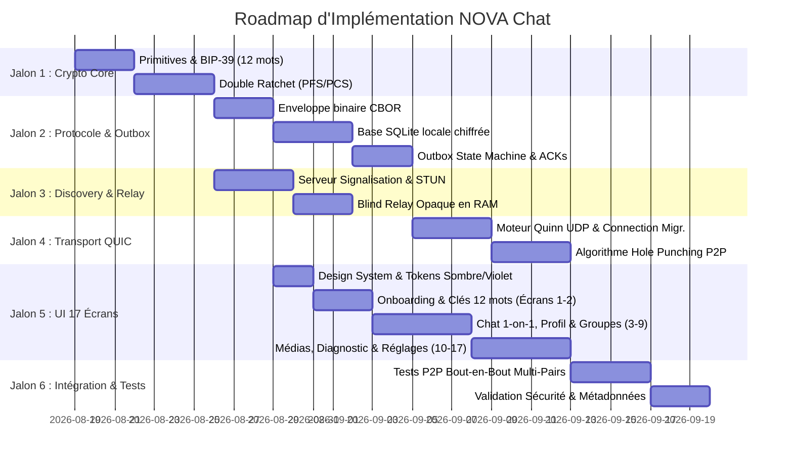

# Plan Complet d'Implémentation Technique : NOVA Chat (MySend)

> **Note de mise à jour (2026-08-22)** — Ce document décrit le plan d'origine. L'architecture
> réseau a depuis migré vers un DHT Kademlia (voir `core/nova-transport/src/dht_node.rs`) : le
> module `discovery-server` décrit en section 1/3.3 ci-dessous (registre de présence + STUN +
> relais aveugle, servi par un unique serveur central) n'est **plus le chemin principal**. Le
> point d'entrée réseau réel est désormais `nova-bootstrap` (un pair libp2p ordinaire, sans
> privilège particulier — voir son propre README) combiné à la découverte mDNS locale et au
> relais/traversée NAT natifs de libp2p (`circuit-relay-v2` + DCUtR). `stun.rs`, mentionné en
> section 1, n'existe pas dans l'implémentation actuelle — la réflexion d'adresse est assurée par
> le protocole `identify` de libp2p, pas par un serveur STUN dédié.
>
> Le crate `server` (`nova-server`) existe toujours et **a été rebranché comme chemin de secours
> en production** (voir `core/nova-transport/src/udp_fallback.rs`) plutôt que laissé orphelin : un
> appareil qui ne peut encore joindre aucun pair libp2p (ni LAN via mDNS, ni le bootstrap DHT
> configuré) peut toujours déposer un paquet chiffré opaque sur un `nova-server` connu
> (`NOVA_UDP_FALLBACK_ADDR`) pour qu'un pair inatteignable autrement le récupère au sondage
> suivant. Ce chemin est fire-and-forget (aucune confirmation de livraison en temps réel, à la
> différence du chemin DHT/QUIC) : `nova-engine` ne le traite jamais comme une preuve de livraison,
> seulement comme une chance supplémentaire d'acheminement.


## 1. Architecture Globale du Workspace

Le projet est structuré sous forme de monorepo modulaire articulé autour d'un **Core Rust natif** réutilisable et d'une **interface multiplateforme** :

```text
MySend/
├── Cargo.toml                      # Workspace Cargo principal
├── core/                           # Moteur Souverain P2P (Rust)
│   ├── nova-crypto/                # BIP-39, Ed25519, X25519, Double Ratchet, AEAD
│   ├── nova-protocol/              # Trame binaire CBOR, types de messages, ACK
│   ├── nova-storage/               # SQLCipher/SQLite, Outbox queue, Indexation FTS5
│   ├── nova-transport/             # QUIC (Quinn), STUN Hole Punching, Blind Relay client
│   └── nova-engine/                # Orchestrateur central, API FFI / Bindings
├── server/                         # Serveur de Découverte & Signalisation (Rust)
│   ├── src/
│   │   ├── discovery.rs            # Registre de présence éphémère en RAM
│   │   ├── stun.rs                 # Résolution d'adresses réflexives
│   │   └── relay.rs                # Forwarder de paquets opaques (Zero-Knowledge)
│   └── Cargo.toml
├── ui/                             # Interface Multiplateforme Responsive (17 Écrans)
│   ├── src/
│   │   ├── theme/                  # Palette sombre #080A10, violet #8B5CF6, typographie
│   │   ├── components/             # 20 Composants UI réutilisables
│   │   ├── screens/                # Les 17 écrans de la maquette
│   │   └── state/                  # State management réactif & Bridge Core Rust
│   └── package.json
└── docs/                           # Documentation d'architecture & Spécifications
```

---

## 2. Découpage Phasé des Jalons d'Implémentation



---

## 3. Spécification Détaillée des Modules

### 3.1 Module 1 : `nova-crypto` (Noyau Cryptographique 1-to-1)
* **Objectif** : Zéro dépendance serveur pour la sécurité.
* **Fonctionnalités** :
  1. `IdentityManager` : Génération du mnémonique BIP-39 (12 mots), dérivation de la seed maîtresse via `Argon2id` et `HKDF-SHA256`.
  2. `KeyPair` : Paires Ed25519 (Signature d'identité) et X25519 (Échange de clés de chiffrement).
  3. `RatchetSession` : Implémentation complète du *Double Ratchet Algorithm* 1-to-1 (Root Key KDF, Symmetric Chain, DH Ratchet Step, chiffrement AEAD ChaCha20-Poly1305 avec effacement mémoire immédiat `zeroize`).
  4. `SafetyNumber` : Calcul d'empreinte d'authenticité hors-bande (BLAKE3) pour affichage et QR Code.

### 3.2 Module 2 : `nova-protocol` & `nova-storage` (Trame Binaire & Outbox 1-to-1)
* **Objectif** : Format de paquet compact et gestion asynchrone hors-ligne de pair à pair.
* **Fonctionnalités** :
  1. `PacketFrame` (CBOR) : Enveloppe binaire avec Magic Header `NOVA`, type de trame (Handshake, Message, Ack, Discovery), identifiant de session, numéro de séquence et charge utile chiffrée.
  2. `DatabaseStore` : SQLite chiffré contenant les tables `identities`, `contacts`, `conversations` (liées 1-to-1 par `peer_id`), `messages` et `outbox_queue`.
  3. `OutboxEngine` : File d'attente d'expédition avec machine à états (`CREATED` $\rightarrow$ `ENCRYPTED` $\rightarrow$ `QUEUED` $\rightarrow$ `SENT` $\rightarrow$ `DELIVERED` $\rightarrow$ `READ`), renvoi adaptatif avec backoff exponentiel.

### 3.3 Module 3 : `discovery-server` (Signalisation Éphémère & Relais Opaque)
* **Objectif** : Permettre à $A$ et $B$ de se joindre sans stocker leurs données.
* **Fonctionnalités** :
  1. `PresenceRegistry` : Table de hachage en mémoire vive (RAM) associant `PubKey` $\rightarrow$ `[IP:Port public, IP:Port local, Timestamp]` avec expiration TTL automatique (30 secondes).
  2. `StunResolver` : Réflexion d'adresses IP publiques pour le Hole Punching UDP.
  3. `BlindRelay` : Canal de transit de blocs chiffrés sans conservation sur disque en cas d'échec du P2P direct.

### 3.4 Module 4 : `nova-transport` (QUIC & Traversée NAT 1-to-1)
* **Objectif** : Connexion rapide, robuste et résiliente aux changements de réseau entre deux pairs.
* **Fonctionnalités** :
  1. `QuicTransport` : Pile Quinn (QUIC sur UDP), multiplexage de flux indépendants (flux de contrôle, flux de messages, flux de fichiers).
  2. `NatTraverser` : Émission coordonnée de paquets de Hole Punching vers l'adresse réflexive du pair.
  3. `ConnectionSupervisor` : Détection des ruptures de lien, Keep-Alive adaptatif et migration de connexion QUIC transparente (Wi-Fi $\leftrightarrow$ 4G/5G).

### 3.5 Module 5 : `ui` (Interface Multiplateforme Responsive - 15 Écrans 1-to-1)
* **Objectif** : Rendre la technologie P2P invisible tout en offrant une expérience visuelle moderne et fluide.
* **Composants & Écrans** :
  1. **Thème & Design System** : Palette `#080A10`, `#11141C`, `#171A24`, violet `#8B5CF6`, vert `#22C55E`, typographie Inter.
  2. **15 Écrans Dédiés 1-to-1** :
     * *Onboarding & Sécurité* : Bienvenue, Création de compte (12 mots), Réglages d'identité, QR Code d'identité, Diagnostics de connexion QUIC.
     * *Messagerie Principale 1-to-1* : Liste des conversations directes, Discussion 1-on-1 (avec statut `● Direct` / `↗ Relayé`), Profil du contact.
     * *Gestion des Pairs* : Liste des contacts, Ajout de contact direct (Recherche @handle, Scanner QR Code).
     * *Gestion & Utilitaires* : Médias partagés (photos/fichiers 1-to-1), Appareils connectés, Préférences notifications, Recherche globale FTS5.
  3. **Adaptabilité Multi-Écran** : 1 colonne sur smartphone, 2 colonnes sur tablette (*Split-View*), 3 colonnes sur PC Desktop (*Triple-Pane*).

---

## 4. Première Étape Immédiate d'Exécution

Nous démarrons immédiatement par le **Jalon 1 (Core Crypto & Workspace Rust)** :
1. Initialisation de l'espace de travail Cargo (`Cargo.toml` workspace) et des sous-crates.
2. Implémentation du module `nova-crypto` :
   * Mnémonique BIP-39 et dérivation de clés.
   * Chiffrement ChaCha20-Poly1305 et signatures Ed25519.
   * Moteur complet du **Double Ratchet** avec tests unitaires de validation cryptographique.
